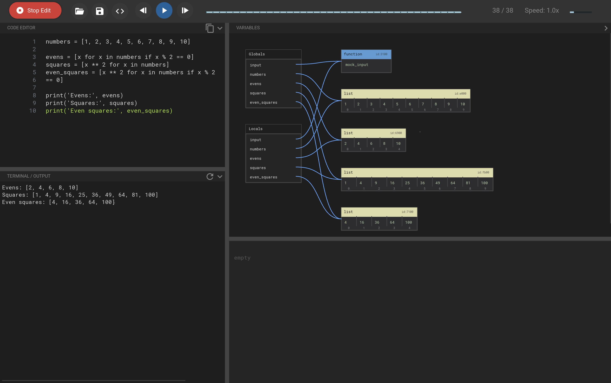

# Python Execution Visualizer

เครื่องมือแสดงผลการทำงานของโค้ด Python แบบ Real-time สร้างขึ้นด้วย Kivy และ KivyMD แอปพลิเคชันนี้ทำให้นักพัฒนาและผู้เรียนสามารถไล่ดูการทำงานของโค้ด Python ได้ทีละบรรทัด พร้อมสังเกตสถานะของตัวแปร , Call Stack และผลลัพธ์บน Terminal ได้แบบ Real-time

## UI Overview



## Key Features

- **แสดงผลแบบเรียลไทม์ (Real-time Visualization)**: ดูโค้ดทำงานทีละบรรทัดด้วยระบบ Tracing
- **รองรับการรับข้อความจากผู้ใช้ (Interactive Input Support)**: สามารถพิมพ์ตอบสนองคำสั่ง `input()` ได้โดยตรงผ่าน Terminal ในตัว
- **ตรวจสอบตัวแปร (Variable Inspection)**: ติดตามการเปลี่ยนแปลงของตัวแปร Local และ Global ในทุกๆ ขั้นตอน
- **ติดตาม Call Stack (Call Stack Tracking)**: แสดงผล Stack ของฟังก์ชันที่กำลังทำงานและการสลับการทำงานระหว่าง Frame
- **มี Terminal ในตัว (Integrated Terminal)**: โปรแกรมจำลอง Terminal ครบวงจรสำหรับแสดงผลลัพธ์ของโปรแกรมและให้ผู้ใช้โต้ตอบได้
- **เลื่อนดูประวัติและการเล่นซ้ำ (Scrubbing & Playback)**: สามารถเลื่อนดูประวัติการทำงานของโปรแกรมเดินหน้าและถอยหลังได้ v
- **วิเคราะห์การทำงาน (Execution Analytics)**: ติดตามได้ว่าแต่ละบรรทัดถูกเรียกใช้งานไปกี่ครั้ง

## Architecture

โปรเจกต์นี้มีการแยกส่วนการทำงานอย่างชัดเจนระหว่าง Core Execution Engine (ระบบประมวลผลหลัก) และ Graphical Interface (ส่วนแสดงผลทางหน้าจอ)

### ระบบประมวลผลหลัก (`/core`)
- **`tracer.py`**: ใช้ `sys.settrace` ในการฝังตัวเข้าไปในโค้ด Python เพื่อดักจับ Event การทำงานระดับบรรทัด, คืนค่า, การเปลี่ยน Call Stack และค่าของตัวแปรที่ถูก Serialize แล้ว โดยมี Callback `on_step` สำหรับส่งข้อมูลอัปเดตแบบ Streaming
- **`executor.py`**: จัดการสภาพแวดล้อมการรันโค้ด จัดการเรื่องการ Parse โค้ด, การตัดการทำงานเมื่อเกินเวลา (Timeout) และมีฟังก์ชัน `input()` จำลองเพื่อเชื่อมโยง Background Thread ที่ใช้ประมวลผลเข้ากับ Terminal UI
- **`terminal.py`**: จำลอง Terminal โดยใช้ `pyte` จัดการ PTY (Pseudo-terminal) ระดับล่างสำหรับทั้งระบบ Windows และ Unix และซิงค์สถานะเข้ากับข้อมูลใน Buffer ของ Tracer

### ส่วนของ UI (`/`)
- **`main.py`**: เป็น Entry Point และส่วนควบคุมหลักของแอปพลิเคชัน จัดการ Event Loop ของ Kivy, ควบคุม Thread Safety (ด้วย `Clock.schedule_once`) และอัปเดตองค์ประกอบของ UI ต่างๆ ตามสถานะ Trace ที่ถูกส่งเข้ามา
- **Kivy Layouts**: ใช้ระบบ Layout แบบแบ่งโมดูล (Modular) สำหรับพื้นที่เขียนโค้ด (Code Editor), ต้นไม้ตัวแปร (Variable Tree), Call Stack, และ Panel ของ Terminal

## Technical Implementation Details

### กลไกการรับ Input โต้ตอบ (Interactive Input Mechanism)
หนึ่งในฟีเจอร์ที่ซับซ้อนที่สุดคือการรองรับการหยุดรอคำสั่ง `input()` แบบ Synchronous ภายใน UI ที่ทำงานแบบ Asynchronous
1. เมื่อโค้ดถูกประมวลผลมาถึงคำสั่ง `input()` ระบบจะเรียกฟังก์ชัน `mock_input` ของเราใน Background Thread
2. `mock_input` จะเขียนข้อความ Prompt ลงใน Buffer และหยุดรอ (Block) ด้วย `threading.Event`
3. UI จะตรวจจับสถานะว่าโปรแกรมกำลังรอผู้ใช้ป้อนข้อมูล และทำการโฟกัสไปยังหน้า Terminal 
4. เมื่อผู้ใช้พิมพ์ตัวอักษรลงใน Terminal สัญญาณจะถูกสตรีมส่งกลับไปที่ Buffer ของ Tracer แบบเรียลไทม์เพื่อให้ UI ทั้งจอเกิดการอัปเดตตาม
5. ทันทีที่ผู้ใช้กดปุ่ม **Enter** ระบบจะตั้งค่า `Event` เพื่อนำข้อความคืนกลับไปให้โปรแกรม Python และการทำงานก็จะดำเนินต่อไป

### กลยุทธ์การซิงค์ข้อมูล Terminal (Terminal Sync Strategy)
เพื่อให้หน้าตาของ Terminal แสดงผลได้สมบูรณ์ถูกต้องเสมอ (โดยเฉพาะระหว่างที่มีการรับ Input แบบเรียลไทม์) เราเลือกใช้กลยุทธ์ **Full Sync** หรือซิงค์ข้อมูลใหม่ทั้งหมด โดยแทนที่จะใช้วิธีนำข้อความมาต่อท้ายเรื่อย ๆ (Append) ตัว UI จะคอยเรียกคำสั่ง `sync_with_stdout(full_text)` ซึ่งจะล้างสถานะการจำลอง Terminal เดิมออกและป้อนประวัติการทำงานทั้งหมดเข้าไปใหม่เสมอ วิธีนี้จะป้องกันปัญหาข้อความเลื่อนตำแหน่งผิด และทำให้แน่ใจว่าการกด Backspace แก้ไขคำระหว่างรอ Input แสดงผลออกมาได้อย่างสมบูรณ์แบบ

## การเริ่มต้นใช้งาน 

### สิ่งที่ต้องมีเบื้องต้น
- Python 3.10 ขึ้นไป
- `uv` (แนะนำ) หรือ `pip`

### การติดตั้ง

#### วิธีที่ 1: ใช้ `uv` (แนะนำ)
1. Clone โปรเจกต์:
   ```bash
   git clone https://github.com/psu6810110042/python-execution-visualizer.git
   cd python-execution-visualizer
   ```
2. ติดตั้ง Dependencies:
   ```bash
   uv sync
   ```
3. การรันแอปพลิเคชัน:
   ```bash
   uv run main.py
   ```

#### วิธีที่ 2: ใช้ `pip`
1. Clone โปรเจกต์:
   ```bash
   git clone https://github.com/psu6810110042/python-execution-visualizer.git
   cd python-execution-visualizer
   ```
2. สร้างและเปิดใช้งาน Virtual Environment:
   ```bash
   # สำหรับ macOS/Linux
   python3 -m venv .venv
   source .venv/bin/activate

   # สำหรับ Windows
   python -m venv .venv
   .venv\Scripts\activate
   ```
3. ติดตั้ง Dependencies:
   ```bash
   pip install "kivy[base]>=2.3.1" pygments pyte docutils plyer
   pip install https://github.com/kivymd/KivyMD/archive/master.zip
   ```
   > [!NOTE]
   > หากอยู่บน Windows อาจจำเป็นต้องติดตั้ง dependencies เพิ่มเติมสำหรับ Kivy: `pip install kivy-deps.angle kivy-deps.glew kivy-deps.sdl2`

4. การรันแอปพลิเคชัน:
   ```bash
   # Windows
   python main.py
   # macOS
   python3 main.py หรือ python main.py
   ```

## Commands & Hotkeys

### การควบคุมทั่วไป (General Controls)
- **Ctrl + Enter**: เริ่มต้นการทำงาน (Run) หรือ หยุดการทำงานเพื่อแก้ไขโค้ด (Stop Edit)
- **Ctrl + R**: เริ่มการทำงานของ Terminal ใหม่ (Restart Terminal)
- **Space**: เล่น (Play) หรือ พัก (Pause) การแสดงผล (ใช้งานได้เมื่อรันโค้ดแล้ว)

### การจัดการหน้าจอ (Panels Management)
- **Ctrl + 1**: เปิด/ปิด หน้าจอ Terminal
- **Ctrl + 2**: เปิด/ปิด หน้าจอ Code Editor (ขณะกำลัง Trace โค้ด)
- **Ctrl + `** (ปุ่ม Grave Accent): เปิด/ปิด แผงควบคุมด้านขวา (Variable Tree & Call Stack)

### การปรับแต่งการแสดงผล (Visual Settings)
- **Ctrl + Mouse Scroll**: เพิ่ม/ลด ขนาดตัวอักษรในแผงที่เมาส์อยู่
- **Ctrl + +** / **Ctrl + =**: เพิ่มขนาดตัวอักษร
- **Ctrl + -**: ลดขนาดตัวอักษร
- **Ctrl + 0**: คืนค่าตัวอักษรเป็นปกติ

### การไล่โค้ด (Execution Control)
- **ลูกศรขวา (Right Arrow)**: เลื่อนไปข้างหน้า 1 ขั้นตอน (Step Forward)
- **ลูกศรซ้าย (Left Arrow)**: ย้อนกลับ 1 ขั้นตอน (Step Backward)
- **ลูกศรขึ้น (Up Arrow)**: เพิ่มความเร็วในการเล่น (Speed Up)
- **ลูกศรลง (Down Arrow)**: ลดความเร็วในการเล่น (Slow Down)

## Contributing
ยินดีต้อนรับทุกคนที่มีส่วนร่วมกับโปรเจกต์นี้! สามารถส่ง Pull Request เข้ามาได้เลยครับ

## Contributors

โปรเจกต์นี้ได้รับการพัฒนาโดย:

- **Jirakorn Sukmee** ([@psu6810110042](https://github.com/psu6810110042))
    - ออกแบบสถาปัตยกรรมหลักของระบบ (Core Architecture)
    - พัฒนาส่วนประกอบสำคัญอย่าง Tracer และ Serializer สำหรับตรวจสอบสถานะโปรแกรม
    - ออกแบบและปรับปรุง GUI/UX โดยใช้ KivyMD (Material Design) เพื่อความสวยงามและใช้งานง่าย
    - วางรากฐานระบบ Execution และความปลอดภัยในการรันโค้ด

- **Manattee Vilairat** ([@Manattee-vilairat](https://github.com/Manattee-vilairat))
    - พัฒนาฟีเจอร์การแสดงผลข้อมูลแบบ Diagram เพื่อให้เห็นโครงสร้างข้อมูลชัดเจน
    - ปรับปรุงระบบ Terminal ให้รองรับการโต้ตอบ (Input) และคำสั่งต่างๆ
    - เพิ่มฟีเจอร์เสริมใน UI เช่น การปรับขนาดหน้าต่าง, แถบสถานะการเรียกใช้งานบรรทัด (Execution Count Badge) และการแจ้งเตือนการเปลี่ยนค่าตัวแปร
    - รวบรวมและพัฒนาตัวอย่างอัลกอริทึม (Built-in Examples) สำหรับผู้เริ่มต้นใช้งาน
